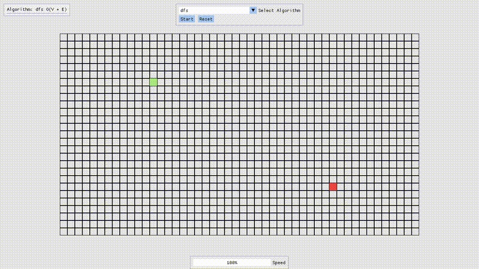

Algolens is an interactive algorithm visualizer designed to help users understand fundamental computer science algorithms through real-time graphical representations.

# Demo


# Build
the build produces a binary `algolens` inside of the `build` directory.

```
git clone https://github.com/mazen-fahim/algolens
cd algolens
git submodule update --init --remote --recursive
cmake -S . -B build
cd build
cmake --build .
```


